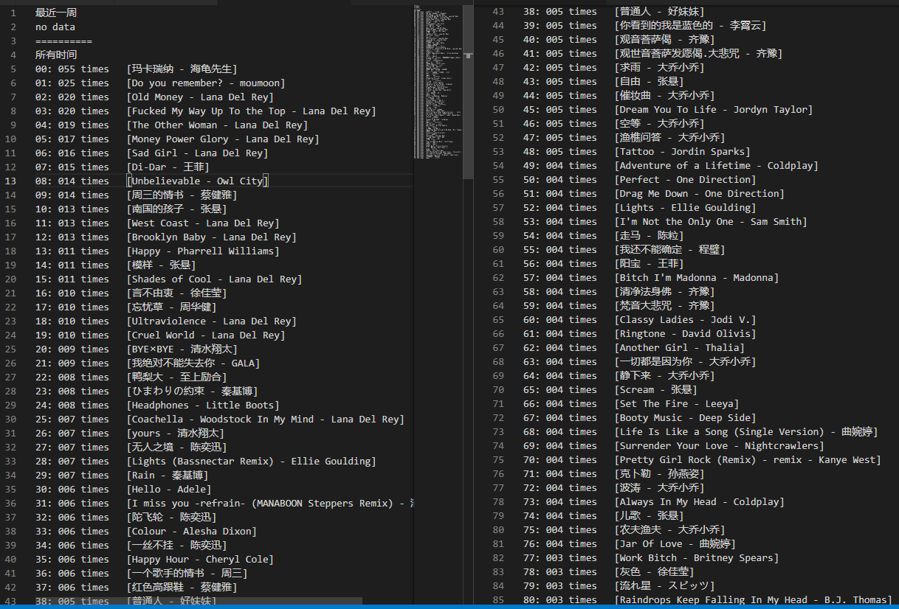

# NCloudMusicPlayCount

计算网易云音乐用户（公开的）听歌排行的播放次数。详见博客——[网易云音乐听歌排行之播放次数](https://wwwpf.github.io/2018/10/10/%E7%BD%91%E6%98%93%E4%BA%91%E9%9F%B3%E4%B9%90%E5%90%AC%E6%AD%8C%E6%8E%92%E8%A1%8C%E4%B9%8B%E6%92%AD%E6%94%BE%E6%AC%A1%E6%95%B0/)

## 效果



## 依赖

基于python3开发，需要安装的库如下：

- requests
- pycrypto

## 使用

设定需要计算播放次数的用户id：

```python
def main():
    user_id = "556458"
    get_record_data(user_id)
    print("done")
```

命令行运行

```shell
python play_count.py
```